# Entity-Relationship Diagram (ERD) - Conceptual (Chen Notation)

Berdasarkan contoh gambar yang Anda berikan (format *Chen Notation*), berikut adalah ERD untuk model aplikasi Anda. Di model-model saat ini belum ada relasi antar-tabel (tidak ada `hasMany` atau `belongsTo`), sehingga diagram di bawah ini memetakan entitas (kotak) dan atributnya (oval).

Anda bisa melihat preview-nya secara visual jika membuka file ini di Markdown viewer yang mendukung Mermaid.

```mermaid
graph TD
    %% --------------------
    %% ENTITAS (Kotak) & LAYOUT
    %% --------------------
    subgraph Baris1[" "]
        direction LR
        User[User]
        Berita[Berita]
        Donasi[Donasi]
    end

    subgraph Baris2[" "]
        direction LR
        Infografis[Infografis]
        JadwalDonor[JadwalDonor]
        Pesan[Pesan]
        StokDarah[StokDarah]
    end

    Baris1 ~~~ Baris2

    style Baris1 fill:none,stroke:none;
    style Baris2 fill:none,stroke:none;
    %% --------------------
    %% ATRIBUT (Oval)
    %% --------------------
    
    %% Atribut User
    U_id([<u>id</u>])
    U_name([name])
    U_email([email])
    U_pass([password])
    
    User --- U_id
    User --- U_name
    User --- U_email
    User --- U_pass

    %% Atribut Berita
    B_id([<u>id</u>])
    B_title([title])
    B_date([date])
    B_cat([category])
    B_exc([excerpt])
    B_cont([content])
    B_img([image])
    B_pub([published])
    
    Berita --- B_id
    Berita --- B_title
    Berita --- B_date
    Berita --- B_cat
    Berita --- B_exc
    Berita --- B_cont
    Berita --- B_img
    Berita --- B_pub

    %% Atribut Donasi
    D_id([<u>id</u>])
    D_nama([nama])
    D_wa([wa])
    D_ket([keterangan])
    D_proof([proof])
    D_date([date])
    D_status([status])

    Donasi --- D_id
    Donasi --- D_nama
    Donasi --- D_wa
    Donasi --- D_ket
    Donasi --- D_proof
    Donasi --- D_date
    Donasi --- D_status

    %% Atribut Infografis
    I_id([<u>id</u>])
    I_bulan([bulan])
    I_tahun([tahun])
    I_kontak([kontak])
    I_stats([stats])
    I_dok([dokumentasi])
    I_pel([pelayanan])
    I_quote([quote])

    Infografis --- I_id
    Infografis --- I_bulan
    Infografis --- I_tahun
    Infografis --- I_kontak
    Infografis --- I_stats
    Infografis --- I_dok
    Infografis --- I_pel
    Infografis --- I_quote

    %% Atribut JadwalDonor
    J_id([<u>id</u>])
    J_date([date])
    J_day([day])
    J_loc([location])
    J_time([time])
    J_quota([quota])

    JadwalDonor --- J_id
    JadwalDonor --- J_date
    JadwalDonor --- J_day
    JadwalDonor --- J_loc
    JadwalDonor --- J_time
    JadwalDonor --- J_quota

    %% Atribut Pesan
    P_id([<u>id</u>])
    P_name([name])
    P_email([email])
    P_phone([phone])
    P_msg([message])
    P_date([date])
    P_read([read])
    P_replied([replied])

    Pesan --- P_id
    Pesan --- P_name
    Pesan --- P_email
    Pesan --- P_phone
    Pesan --- P_msg
    Pesan --- P_date
    Pesan --- P_read
    Pesan --- P_replied

    %% Atribut StokDarah
    S_id([<u>id</u>])
    S_type([type])
    S_wb([wb])
    S_prc([prc])
    S_tc([tc])
    S_status([status])

    StokDarah --- S_id
    StokDarah --- S_type
    StokDarah --- S_wb
    StokDarah --- S_prc
    StokDarah --- S_tc
    StokDarah --- S_status

    %% --------------------
    %% STYLING
    %% --------------------
    %% Warna gelap untuk kotak (Entitas) seperti di contoh
    classDef entity fill:#2c3e50,stroke:#1a252f,stroke-width:2px,color:#ffffff,font-weight:bold;
    %% Warna gelap-medium untuk oval (Atribut) seperti di contoh
    classDef attribute fill:#34495e,stroke:#2c3e50,stroke-width:1px,color:#ffffff;
    
    class User,Berita,Donasi,Infografis,JadwalDonor,Pesan,StokDarah entity;
    class U_id,U_name,U_email,U_pass,B_id,B_title,B_date,B_cat,B_exc,B_cont,B_img,B_pub,D_id,D_nama,D_wa,D_ket,D_proof,D_date,D_status,I_id,I_bulan,I_tahun,I_kontak,I_stats,I_dok,I_pel,I_quote,J_id,J_date,J_day,J_loc,J_time,J_quota,P_id,P_name,P_email,P_phone,P_msg,P_date,P_read,P_replied,S_id,S_type,S_wb,S_prc,S_tc,S_status attribute;
```

